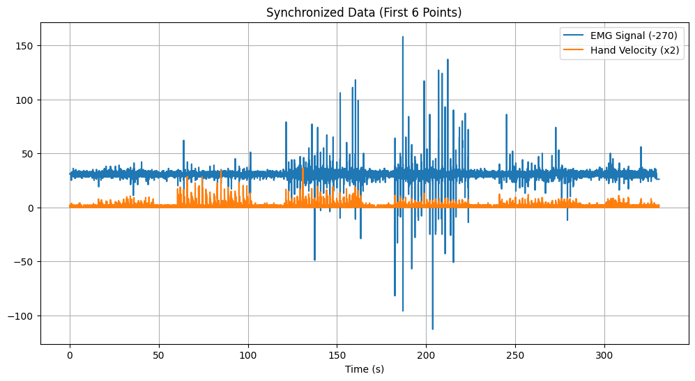

<h1>EMG-MPTrained-Handpose-Prediction</h1>
Hand Pose Prediction using Arm EMG and MeidaPipe 
 

  
     

**English** | [**中文简体**](README_zh.md)

---

## Project Overview

This project aimed to predict hand gestures using arm EMG signals and a MediaPipe model. The intended workflow was as follows:

1. **Data Acquisition:** Place EMG sensors on the arm and simultaneously record EMG signals while capturing hand gestures with a camera. 
2. **Data Processing:** Align the EMG signals with hand keypoint coordinates extracted by MediaPipe for training purposes.
3. **Model Training:** Train a model to identify the relationship between EMG signals and hand gestures.
4. **Gesture Prediction:** Utilize the trained model to predict hand gestures based on real-time EMG signal acquisition.

However, due to challenges in acquiring and processing arm EMG signals, as well as an overly simplistic project scope, this project ultimately faced setbacks.  

---

## Project Replication

- **Related Materials Preparation** 

  - Hardware Preparation
    - A dry electrode and its accompanying sensor (from Taobao, just a random purchase🙄)
    - Due to being a beginner with microcontrollers, the Arduino UNO3 development board was used.
    
    
  - Environment Preparation
    - Install CH340 driver
    - Install the environment according to [requirements.txt](requirements.txt) (This was directly exported from Anaconda, it might be a bit messy🤗, basically installed ultralytics, mediapipe, opencv and torch)

- **Sample Collection** 

  - Electromyography (EMG) Data Acquisition
    - Although I thought placing the electrode on the upper arm should also capture signals, it seems that placing it near the **radial wrist flexor** on the forearm yields better results (according to my many attempts ~~by naked eye~~, I observed significant feature differences in the measured signal when different fingers moved) 
    - After connecting the serial port, upload [ff_output_signal_sampling.ino](Arduino%26Processing4_Emg/Arduino_Part/FF_Output_Signal_Sampling/ff_output_signal_sampling.ino) (other code can also be used for initial testing) to Arduino IDE and run [enhanced_serial_signal_logging.pde](Arduino%26Processing4_Emg/Processing4_Part/Enhanced_Serial_Signal_Logging/enhanced_serial_signal_logging.pde) in Processing4 to record the measured data, obtaining files like [emg_data.csv](Cross_Modal_Action_Recognition_Training/Backup_Database_and_Model_Repository_TOP/Emg_Data/emg_data.csv)
  - Hand Posture Acquisition (Actually, I originally wanted to collect arm posture together, but found that placing an electrode in only one place couldn't accommodate both up and down movements, so it had to be temporarily shelved. Decided to measure only hand data for now😞)
    - While recording EMG signals, start recording the video. Repeatedly perform different gestures with one hand in a regular manner🖐️☝️✌️🖖🤘👍✊🫳 
    - Use the MediaPipe model [ff_hand_landmark02_generate.py](MediaPipe_HandPose/ff_hand_landmark02_generate.py) to identify key points in the video and convert them into coordinates [hand_landmarks.csv](MediaPipe_HandPose/hand_landmarks.csv) (Originally, I wanted to use the recently released YOLOv11 algorithm for key point coordinate recognition [YOLOv11_HandPose](YOLOv11_HandPose), but there was no ready-made model. It took more than a week to manually annotate and train the data, but due to insufficient samples, the resulting model performed very poorly😓. It wasn't until later that I discovered the availability of existing MediaPipe models)

- **Data Alignment** 
   - [Step1_Data_Processing_and_Alignment](Cross_Modal_Action_Recognition_Training/Step1_Data_Processing_and_Alignment) uses [ff_data_realignment_and_validation_n250205.ipynb](Cross_Modal_Action_Recognition_Training/Step1_Data_Processing_and_Alignment/ff_data_realignment_and_validation_n250205.ipynb) for data preprocessing or [eng_analyse.m](Cross_Modal_Action_Recognition_Training/Step1_Data_Processing_and_Alignment/MATLAB_Inspection_Data/eng_analyse.m) and [handmark_analyse.m](Cross_Modal_Action_Recognition_Training/Step1_Data_Processing_and_Alignment/MATLAB_Inspection_Data/handmark_analyse.m) for manual analysis and alignment annotation

   - Verify data format correctness 

     EMG data sample: 

     | num  | time_ms | value | time |
     | ---- | ------- | ----- | ---- |
     | 0    | 0.0     | 301.0 | 0.00 |
     | 1    | 20.0    | 300.0 | 0.02 |
     | 2    | 40.0    | 302.0 | 0.04 |

     Hand data sample: 

     | num  | frame_id | x_0   | y_0   | x_1   | y_1   | x_2  | y_2   | x_3  | y_3   | x_4  | ...  |
     | ---- | -------- | ----- | ----- | ----- | ----- | ---- | ----- | ---- | ----- | ---- | ---- |
     | 0    | 0        | 176.0 | 101.0 | 116.0 | 142.0 | 78.0 | 201.0 | 60.0 | 254.0 | 38.0 | ...  |
     | 1    | 1        | 173.0 | 98.0  | 114.0 | 139.0 | 77.0 | 199.0 | 61.0 | 256.0 | 40.0 | ...  |
     | 2    | 2        | 173.0 | 97.0  | 115.0 | 138.0 | 77.0 | 199.0 | 61.0 | 255.0 | 39.0 | ...  |

   - Check peak detection results

    

   - Plot the fitting results to verify the mapping effect

    

   - Plot the synchronized data for confirmation

    

   - Export to obtain the aligned annotated data [synced_data_6points.csv](Cross_Modal_Action_Recognition_Training/Step1_Data_Processing_and_Alignment/synced_data_6points.csv)

- **Model Training** 
  - Enter the [Step2_Model_Training_and_Validation](Cross_Modal_Action_Recognition_Training/Step2_Model_Training_and_Validation) folder, you can use [ff_refined_training_evaluation_and_prediction.py](Cross_Modal_Action_Recognition_Training/Step2_Model_Training_and_Validation/ff_refined_training_evaluation_and_prediction.py) to train the model (but for some reason, the loss keeps above 200 during training and never goes down, which could be one reason why the results are not as expected🤔), this will give you PyTorch format dataset [handpose_dataset.npz](Cross_Modal_Action_Recognition_Training/Step2_Model_Training_and_Validation/backup_database_and_model_repository/handpose_dataset.npz) and prediction model [hand_model.pth](Cross_Modal_Action_Recognition_Training/Step2_Model_Training_and_Validation/backup_database_and_model_repository/hand_model.pth)

- **Pose Prediction** 
  - Enter the [Step3_Pose_Prediction_Implementation](Cross_Modal_Action_Recognition_Training/Step3_Pose_Prediction_Implementation) folder and run [pose_prediction.py](Cross_Modal_Action_Recognition_Training/Step3_Pose_Prediction_Implementation/pose_prediction.py). Connect the sensor and configure the serial port to call the previously trained prediction model for hand posture prediction based on the collected signals, but at this point, you will find that the predicted postures are significantly different from what is expected, which is also where the project failed.

---

## TODO List

- [ ] **Base Optimization** ★★★★★

  - [ ] **Investigate further reasons for subpar results** 🤔
  - [ ] Improve Signal Quality
      - [ ] Transition from single to multi-electrode setup
      - [ ] Implement hardware filtering circuits
      - [ ] Experiment with various electrode placement schemes
      - [ ] Minimize motion artifacts and other interference at the hardware level
  - [ ] Enhance Data Quality
      - [ ] Design standardized action recording protocols (e.g., fixed angle/force)
      - [ ] Develop code to automatically remove anomalous signal segments
      - [ ] Optimize data annotation processes for keypoint correction

  - [ ] Boost Generalizability
      - [ ] Shift electrode signal acquisition from forearm to upper arm
      - [ ] Expand dataset to include various hand gesture datasets
      - [ ] Explore diverse dataset preprocessing, partitioning, and labeling techniques

  - [ ] ……

      

- [ ] **Feature Optimization** ★★★★☆

  - [ ] Integrate time-frequency domain features 
  
  - [ ] Experiment with different window lengths
  
  - [ ] ……
  
  
  
- [ ] **Model Upgrades** ★★★☆☆

  - [ ] Dynamic Time Warping (DTW) alignment loss
  - [ ] Domain Adaptation to address individual variations
  - [ ] ……

- [ ] **Long-Term Planning** ★★☆☆☆
  - [ ] (Placeholder for future ideas)

---

## Thanks to all contributors for their hard work!

[Back to top 🚀](https://github.com/TurkeyC/EMG-MPTrained-Handpose-Prediction?tab=readme-ov-file#readme)