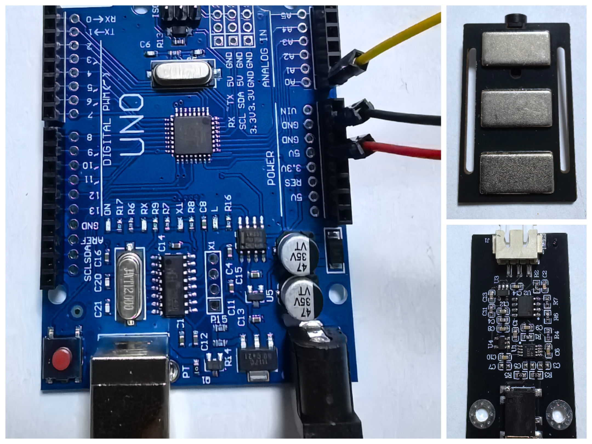
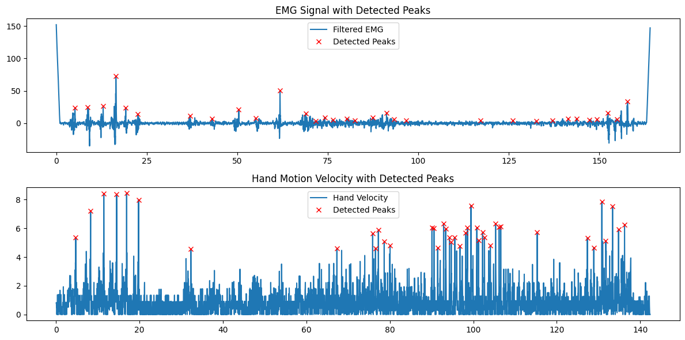

<h1>EMG-MPTrained-Handpose-Prediction</h1>

基于手臂EMG与MeidaPipe模型训练的手部姿态预测的一次~~失败的~~尝试 
 

  
     

[**English**](README.md) | **中文简体**

---

## 项目概述
这个项目的最初目的是通过手臂EMG信号和MediaPipe模型训练来预测手部姿态。预期的流程如下：

 1. **数据采集**：在手臂上放置EMG传感器，同步记录EMG信号和摄像头捕捉的手部姿态。

 2. **数据处理**：将EMG信号与MediaPipe提取的手部关键点坐标对齐，用于训练。

 3. **模型训练**：通过训练找出EMG信号与手部姿态之间的关系，生成预测模型。

 4. **姿态预测**：利用训练好的模型，根据实时采集的EMG信号预测手部姿态。

但是，由于手臂EMG信号的采集和处理存在一些问题以及对项目的规划设想过于简单，导致了这个项目的失败。

---

## 项(shi)目(bai)复现

- 相关材料准备

  - 硬件准备
    - ~~从淘宝上随便买的~~一块干电极以及配套的传感器🙄
    - 由于是单片机新手所以使用了Arduino UNO3开发板
    
    
  - 环境准备
    - 安装CH340驱动
    - 根据 [requirements.txt](requirements.txt) 安装环境 (这个是我直接在Anaconda导出的，可能有点乱哈🤗，大致上就是安装了ultralytics、mediapipe、opencv和torch)

- 样本采集

  - 肌电数据采集
    - 虽然我觉得电极放在上臂也应该可以采集到信号，但是发现当电极放在小臂的**桡侧腕屈肌**附近的效果似乎比较好（据我的多次尝试~~通过肉眼~~发现在这里不同手指运动时的测得信号出现了明显的特征差异）
    - 连接串口后使用ArduinoIDE上传 [ff_output_signal_sampling.ino](Arduino%26Processing4_Emg/Arduino_Part/FF_Output_Signal_Sampling/ff_output_signal_sampling.ino)（也可以使用其他代码先进行测试），在使用Processing4运行 [enhanced_serial_signal_logging.pde](Arduino%26Processing4_Emg/Processing4_Part/Enhanced_Serial_Signal_Logging/enhanced_serial_signal_logging.pde) 来记录测得的数据，获得文件如 [emg_data.csv](Cross_Modal_Action_Recognition_Training/Backup_Database_and_Model_Repository_TOP/Emg_Data/emg_data.csv)
  - 手部姿态采集（其实本来想要一起采集手臂姿态的，但是发现只在一个地方放置电极的话没办法兼顾上下，于是就只能暂时搁置，决定只测量手部数据😞）
    - 在肌电信号采集的同时开始录像，单手规律重复做出不同的姿态🖐️☝️✌️🖖🤘👍✊🫳
    - 使用MediaPipe模型 [ff_hand_landmark02_generate.py](MediaPipe_HandPose/ff_hand_landmark02_generate.py) 来识别视频中的手部关键点，并转换为坐标数据 [hand_landmarks.csv](MediaPipe_HandPose/hand_landmarks.csv)（原本我想要使用近期新出的YOLOv11算法来进行关键点坐标识别 [YOLOv11_HandPose](YOLOv11_HandPose)，但是没有现成的模型，耗费一周多手动数据标注与训练，结果由于样本太少导致得到的模型实际效果极其拉跨😓，直到后来才发现有现成的MediaPipe可用）

- 数据对齐

  - 在 [Step1_Data_Processing_and_Alignment](Cross_Modal_Action_Recognition_Training/Step1_Data_Processing_and_Alignment) 中使用 [ff_data_realignment_and_validation_n250205.ipynb](Cross_Modal_Action_Recognition_Training/Step1_Data_Processing_and_Alignment/ff_data_realignment_and_validation_n250205.ipynb) 进行数据预处理，或者用 [eng_analyse.m](Cross_Modal_Action_Recognition_Training/Step1_Data_Processing_and_Alignment/MATLAB_Inspection_Data/eng_analyse.m) 和 [handmark_analyse.m](Cross_Modal_Action_Recognition_Training/Step1_Data_Processing_and_Alignment/MATLAB_Inspection_Data/handmark_analyse.m) 进行人工分析标注对齐

  - 验证数据格式是否正确 

    EMG数据样例: 

    | num  | time_ms | value | time |
    | ---- | ------- | ----- | ---- |
    | 0    | 0.0     | 301.0 | 0.00 |
    | 1    | 20.0    | 300.0 | 0.02 |
    | 2    | 40.0    | 302.0 | 0.04 |

    手部数据样例: 

    | num  | frame_id | x_0   | y_0   | x_1   | y_1   | x_2  | y_2   | x_3  | y_3   | x_4  | ...  |
    | ---- | -------- | ----- | ----- | ----- | ----- | ---- | ----- | ---- | ----- | ---- | ---- |
    | 0    | 0        | 176.0 | 101.0 | 116.0 | 142.0 | 78.0 | 201.0 | 60.0 | 254.0 | 38.0 | ...  |
    | 1    | 1        | 173.0 | 98.0  | 114.0 | 139.0 | 77.0 | 199.0 | 61.0 | 256.0 | 40.0 | ...  |
    | 2    | 2        | 173.0 | 97.0  | 115.0 | 138.0 | 77.0 | 199.0 | 61.0 | 255.0 | 39.0 | ...  |

  - 检查峰值检测结果

    

  - 绘制拟合结果，验证映射效果

    

  - 绘制同步后的数据加以确认

    

  - 导出即可获得对齐后的标注数据 [synced_data_6points.csv](Cross_Modal_Action_Recognition_Training/Step1_Data_Processing_and_Alignment/synced_data_6points.csv)

- 训练模型

  - 进入 [Step2_Model_Training_and_Validation](Cross_Modal_Action_Recognition_Training/Step2_Model_Training_and_Validation) 文件夹，可以使用 [ff_refined_training_evaluation_and_prediction.py](Cross_Modal_Action_Recognition_Training/Step2_Model_Training_and_Validation/ff_refined_training_evaluation_and_prediction.py) 来进行模型的训练（不过不知道怎么回事，训练过程中loss一直在200以上，始终降不下来，这也有可能是结果不如预期的原因之一🤔），这样就可以获得PyTorch格式的数据集 [handpose_dataset.npz](Cross_Modal_Action_Recognition_Training/Step2_Model_Training_and_Validation/backup_database_and_model_repository/handpose_dataset.npz) 和预测模型 [hand_model.pth](Cross_Modal_Action_Recognition_Training/Step2_Model_Training_and_Validation/backup_database_and_model_repository/hand_model.pth)

- 姿态预测

  - 进入 [Step3_Pose_Prediction_Implementation](Cross_Modal_Action_Recognition_Training/Step3_Pose_Prediction_Implementation) 文件夹，运行 [pose_prediction.py](Cross_Modal_Action_Recognition_Training/Step3_Pose_Prediction_Implementation/pose_prediction.py) ，接入传感器并配置串口，即可调用刚才的预测模型，根据采集到的信号进行手部姿态预测，但是这时候就会发现预测出的姿态与期望严重不符，这也就是该项目的失败之处

---

## 待办清单

- [ ] **基础优化 ★★★★★**
  - [ ] **找出还有什么其他原因使得结果远不及预期**🤔
  - [ ] 提升信号质量
    - [ ] 将目前的单电极方案改为多电极方案
    - [ ] 增加硬件滤波电路
    - [ ] 实验尝试不同电极布局方案
    - [ ] 尝试在硬件端尽量减少运动伪影等的干扰
  - [ ] 增强数据质量
    - [ ] 设计标准化动作录制方案，例如固定角度/力度
    - [ ] 尝试编写代码自动剔除异常信号段
    - [ ] 优化数据标注流程，进行关键点修正
  - [ ] 提升泛用性
    - [ ] 将电信号采集位置从小臂改为上臂
    - [ ] 将数据集扩充到多种手势数据集
    - [ ] 尝试更多的数据集预处理、划分、标注方案
  - [ ] ……
  
- [ ] **特征优化 ★★★★☆**
  - [ ] 融合时频域特征
  - [ ] 实验不同窗口长度
  - [ ] ……
  
- [ ] **模型升级与核心算法改进 ★★★★☆**
  - [ ] 动态时间规整DTW对齐损失
  - [ ] 领域自适应（Domain Adaptation）应对个体差异
  - [ ] ~~暂时想不出来了~~
  - [ ] ……
  
  
  
- [ ] **其他的”长远“规划** ★★☆☆☆
  - [ ] ~~现阶段基本实现不了，暂且不想了吧~~
  - [ ] ……

---

## 感谢所有贡献者作出的努力

[回到顶部 🚀](https://github.com/TurkeyC/EMG-MPTrained-Handpose-Prediction?tab=readme-ov-file#readme)